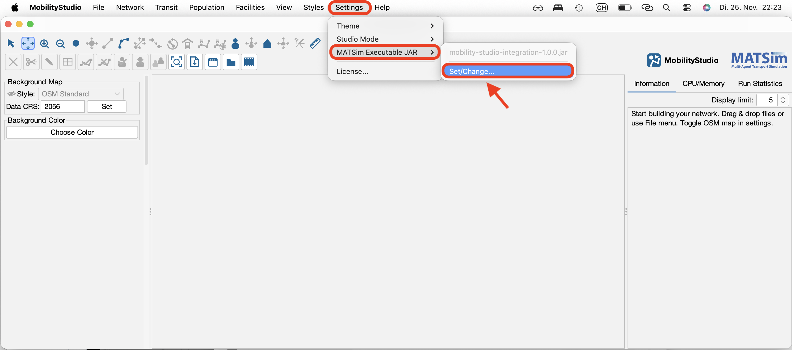
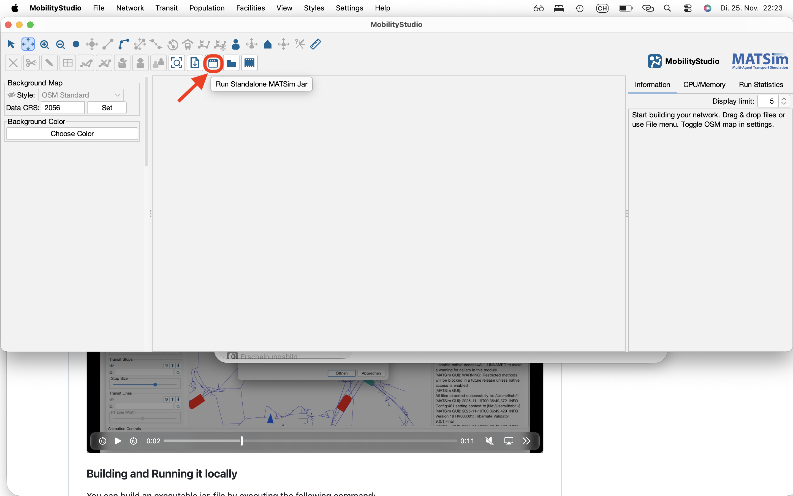
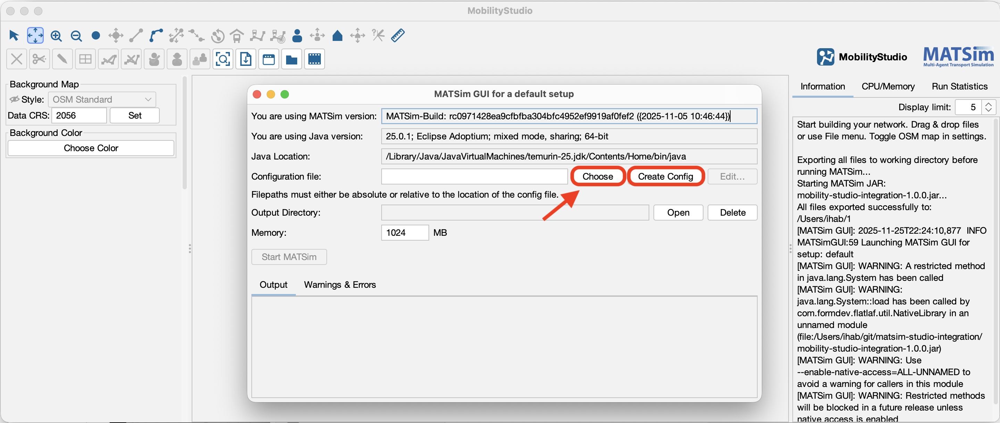
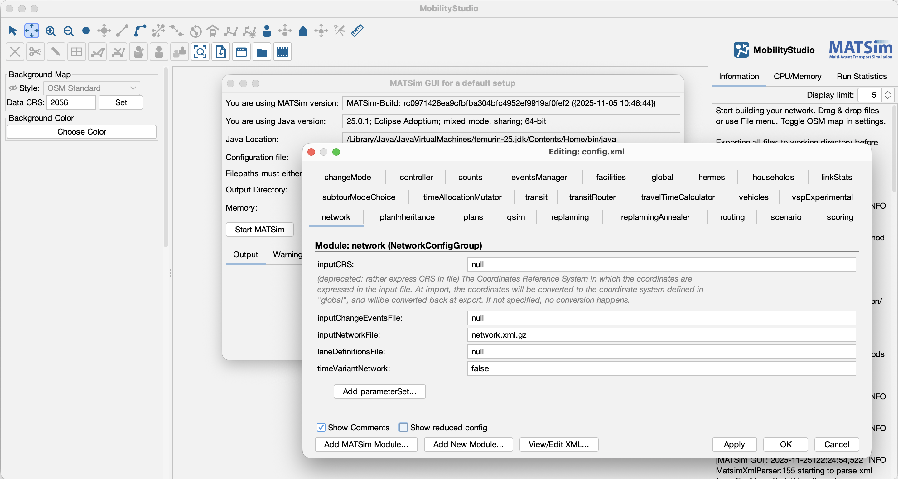

# MobilityStudio Integration


This project is a slightly modified version of the `matsim-example-project`, utilizing MATSim as a library. It extends MATSim's default Graphical User Interface (GUI) by adding a dedicated configuration editor.

The primary goal is to build a "fat" executable JAR file that can be embedded directly into the **MobilityStudio** application. This integration allows users to open the MATSim configuration editor and launch MATSim simulation runs seamlessly from within the MobilityStudio environment.

**🌐 Website:** [www.mobilitystudio.de](https://www.mobilitystudio.de)

---

## 🚀 Integration with MobilityStudio

Follow these steps to utilize the MATSim configuration editor and runner within the MobilityStudio application:

### Step 1: Embed the Executable JAR

Integrate the built executable JAR file into the MobilityStudio application.



### Step 2: Launch the MATSim GUI

Launch the extended MATSim GUI directly from within the MobilityStudio App.



### Step 3: Configure Your Run

Create a new configuration or choose an existing one from the list.
Then, click on the **Edit** button to open the configuration editor.



### Step 4: Adjust the Configuration

Modify the configuration parameters to your needs.

*   **Automatic Path Setting:** Paths for input files will be automatically set if those files have already been loaded or created in the MobilityStudio App.
*   **Advanced Features:** Make use of the "Show reduced config" feature, add custom MATSim modules, or edit the naked XML file directly.



### Step 5: Apply and Start

Click on **Apply** or **OK** to save your changes and close the Config Editor.
Then start the MATSim run.


---

## 🛠️ Adjust to your needs, build and run locally

You can fork this project and adjust it to your specific needs. You may change the MATSim version, add a MATSim contrib, or add your own customized MATSim run class.

Then you need to build an executable JAR file for this project using Maven.

Execute the following command on Linux/macOS:

```sh
./mvnw clean package
```

or on Windows:

```sh
mvnw.cmd clean package
```

This process will download all necessary dependencies (which may take a while the first time) and create a file named mobility-studio-integration-1.0.0.jar in the top directory.

The resulting JAR file can be:

* Embedded into MobilityStudio [www.mobilitystudio.de](https://www.mobilitystudio.de)
* Double-clicked to start the MATSim GUI.
* Executed with Java on the command line:

```sh
java -jar mobility-studio-integration-1.0.0.jar
```


##📜 Licenses

The MATSim program code in this repository is distributed under the terms of the GNU General Public License as published by the Free Software Foundation (version 2). The MATSim program code are files that reside in the src directory hierarchy and typically end with *.java.